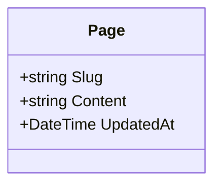
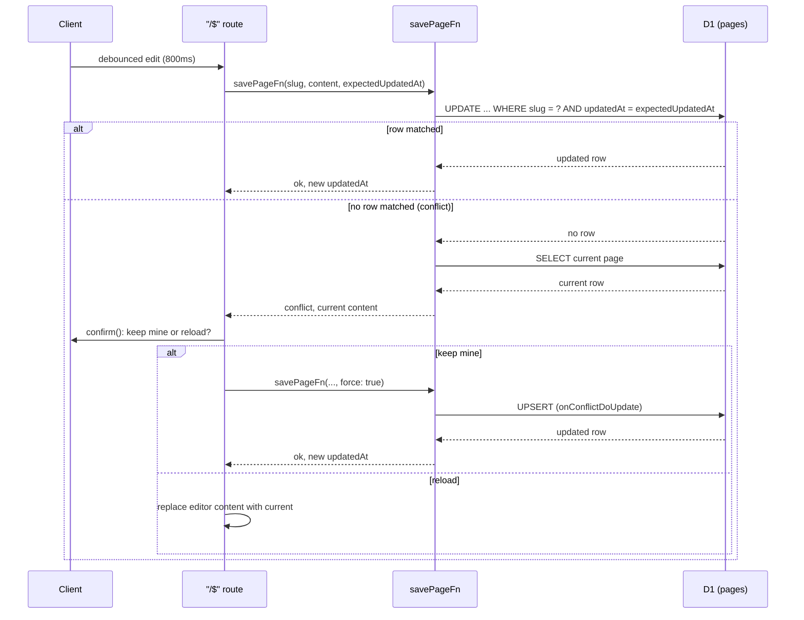

# Architecture

## Domain Model

`Page` is the only entity, keyed by `slug`. There is no separate create step: a page is implicitly created on its first save (`onConflictDoNothing` insert), and a save on an unknown slug with no prior `updatedAt` is that first write. `updatedAt` doubles as the optimistic-concurrency token described below.

## Save Flow

Every keystroke debounces into a `savePageFn` call (800ms, via `useAsyncDebouncer`) carrying the `updatedAt` the client last saw. The server only writes if that value still matches the row, so a save that lost a race never silently overwrites a concurrent edit.

`force: true` bypasses the `updatedAt` check entirely (used for the first write, and for an explicit overwrite after a conflict) via an upsert instead of a conditional update.
